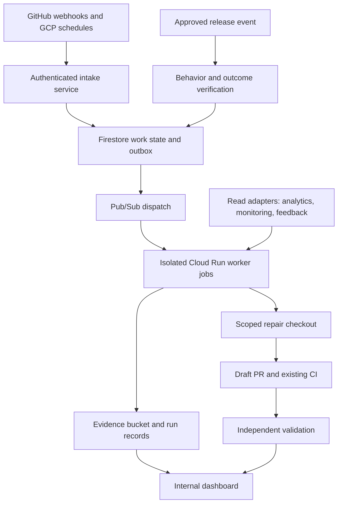

# RFC-CPA-001 — Execution and agent architecture

Date: 2026-09-27. Status: proposed. Parent: [PRD-CPA-001](scope.md). Decision owner: Rashad. Implementation defaults below are proposals, not deployed resources.

## 1. Proposed shape

One GCP control service coordinates short-lived specialist workers through durable work records and Pub/Sub. Fixed workflows handle evidence intake and routine reviews. Bounded tool-using agents handle investigations and repairs. A worker can implement several roles with separate prompts and permissions. Do not build a recursively delegating agent hierarchy in version 1.



Stack: TypeScript backend, schemas shared with a small React internal dashboard, Firebase Auth for authorized internal users, Firestore for state, Cloud Storage for artifacts, Pub/Sub for dispatch, Cloud Scheduler for due tasks, Secret Manager for API/GitHub credentials. Start in one approved US region colocated with artifact/state storage. Confirm product data regions before choosing it; cost model assumes us-central1.

Use provider APIs for unattended inference and containerized workers for execution. Existing desktop subscriptions can assist founder implementation, but are not an assumed source of cloud API entitlement. A provider-hosted agent runtime is a viable substitute for repair workers; control state and product policies remain owned by Cure. No GPUs required.

## 2. Data model and task contracts

| Entity | Required fields / purpose |
|---|---|
| Product | product_id, repo, environments, owner, goals, journey definitions, instruction versions, policy version, concurrency and budget config |
| Release | product_id, environment, source SHA, deployed revision/build IDs, timestamp, artifact links; unknown values explicitly null |
| Run | run_id, trigger key, role, immutable release reference, policy/instruction/model versions, timestamps, status, costs, leases, tool trajectory refs |
| Finding | finding_id, product, class, severity, expected/actual, reproduction, evidence refs, confidence rationale, release, duplicate key, adjudication |
| Work order | work_id, parent finding, allowed paths/actions, acceptance criteria, budgets, task status, branch/PR ref, reviewer verdict |
| Outcome | work/release refs, metric definition/version, baseline/current windows, denominator, confounders, conclusion or insufficient-data reason |
| Policy / authorization | actor, product, action category, environment, approved paths, expiry/version, spend rules, authorized destinations |
| Feedback | reviewer decision, correction, reason, linked evidence; validated memory candidate |

Task envelope:

```json
{
  "schema_version": 1,
  "work_id": "generated-id",
  "product_id": "initiated-recruiting",
  "role": "qa",
  "environment": "staging",
  "release_ref": "immutable-release-id",
  "trigger_key": "provider-event-or-schedule-key",
  "finding_refs": [],
  "acceptance_criteria": ["Unverified coach cannot access Terminal data"],
  "policy_version": "approved-policy-version",
  "instruction_version": "pinned-library-commit",
  "allowed_actions": ["read_evidence", "run_staging_journey"],
  "limits": {"model_calls": 10, "wall_seconds": 300, "usd": 3},
  "idempotency_key": "product-release-role-trigger"
}
```

Worker results are schema-validated before aggregation. A finding without evidence returns hypothesis/blocked, never verified. Publication updates use an idempotency key; failed writes are reconciled by checking durable state before retry.

State transitions: queued → leased → running → evidence_ready → validated → awaiting_review / completed. Repair branches continue through draft_pr → independently_validated → awaiting_human_merge → released → outcome_pending → closed. failed, blocked, cancelled, stale, duplicate, and budget_stopped are explicit terminal/suspension outcomes. An accepted PR is not a verified deployed outcome.

Indexes: work due time/status/product, lease expiry/status, runs by product/release/time, findings by product/dedup key/status, outcomes by due time/product. Store large logs/screenshots outside Firestore; documents contain references and checksums. Enforce project access with backend authorization and Firestore rules; do not grant direct cross-product access to workers.

## 3. Reliability and event semantics

GitHub intake validates webhook signature and installation/repository allowlist, rejects oversized payloads, and deduplicates by delivery ID plus configured review profile. Scheduler endpoints require service-account identity. One due-task sweep dispatches configured work; no GitHub Actions cron.

Firestore transaction writes work state and outbox entry. Publisher retries outbox delivery. A task consumer claims a transactional lease before starting a job. Pub/Sub delivery is treated as at least once; duplicates observe an existing lease/completed result. Renew a 2-minute lease every 30 seconds; after expiry, reconcile job liveness before reassignment. A crash after external mutation requires checking its idempotency marker, not blind replay.

Initial global concurrency 4 worker jobs; at most 2 per product; one active repair per product branch target. Separate reviewer checkout. Work may queue rather than exceed caps. A fairness rule prevents one product from consuming all slots. Targeted reviews and artifact reuse prevent duplicate test spending.

On provider timeout or 429: bounded exponential backoff, at most 2 transport retries within task budget. Do not retry authentication failure or invalid permissions automatically. Dead-letter tasks after 3 dispatch failures; heartbeat sweeper records missed reviews. Daily expected-versus-completed reconciliation detects schedules that stopped firing. Founder is liveness owner; system performs daily checks, founder reviews monthly and on urgent missed-run exceptions.

Proposed availability objective 99% successful intake during pilot; durable run completion tracked separately at 95%. No 24/7 human response SLA. Backup daily control state; retain recovery exports 7 days. Proposed RPO 24 hours and RTO one business day. Before broader release, demonstrate restore of configuration/work history into an isolated environment.

## 4. Tool catalog and access enforcement

Each worker gets only its needed tool subset, normally fewer than 10. Schemas validate product/release refs, paths, query bounds, and allowed environments. Tools are server adapters or sandbox commands; MCP is optional transport, not a permission boundary.

| Tool | Side effects | Idempotent / reversible | Roles |
|---|---|---|---|
| get_product_context | Reads approved config and pinned docs | Yes / n/a | All |
| get_release_evidence | Reads stored CI/artifacts | Yes / n/a | All |
| query_metric_summary | Bounded read from approved aggregated export; may incur query cost | Yes / n/a | PM, coordinator |
| list_product_findings | Reads internal state | Yes / n/a | All |
| inspect_rendered_journey | Executes approved staging/public read-only synthetic; costs compute | Yes for reads / reset isolated fixture | Design, QA |
| run_targeted_tests | Executes untrusted repo code in restricted runner; costs compute | Repeatable with pinned fixture / discard runner | Engineering, QA |
| create_internal_finding | Writes internal evidence/state | Yes with key / mark retracted | Reviewers |
| create_repair_branch | Creates branch in isolated checkout | Yes with work key / delete unused branch | Authorized engineering |
| create_draft_pull_request | Writes designated repo branch and draft PR; may trigger existing CI | Yes with work marker / close draft and revert branch | Authorized engineering |
| submit_review_verdict | Writes independent evidence/verdict | Yes with key / supersede with audit | QA |
| schedule_outcome_check | Writes internal due task | Yes with key / cancel task | Coordinator, PM |

Do not provide arbitrary production DB query/write, deploy, merge, send-email, or billing tools. Route unknown requests to blocked state. Path allowlists exclude secrets, infrastructure, authentication/authorization, payment logic, legal contracts, migrations, CI permission files, and dependency/lock changes by default. Such findings can be reviewed and proposed; implementation needs separately scoped authorization.

GitHub App install is limited to registered repos. Separate read and PR-write capability; ephemeral tokens issued only outside model output. Cloud worker identities access only assigned product evidence. Keep production read adapter separate from sandbox execution. A PR cannot access production credentials. Public site probes use read-only interactions; authenticated writes use disposable staging/emulator accounts.

Treat repo text, issue comments, feedback, screenshots, and tool outputs as untrusted content. Policy enforcement occurs in tool gateway and runner identity, not prompt wording. Restrict egress and filesystem; include test caches explicitly where needed; never mount founder home directories. Tool outputs redact credentials and unnecessary personal information. Use ordinary identity/rules for negative permission tests; do not use mock-admin bypass.

## 5. Agent memory, termination, evaluation

Working memory: last 10 exchanges or 8,000 tokens plus validated task summary. Task scratch state persists to the current work record and is discarded/archived at completion. Long-term memory is product decisions, known failures, approved acceptance criteria, and adjudicated findings with provenance and expiry. Evidence is retrievable by IDs; a vector database is not required initially.

Agent-proposed memory updates enter a candidate queue. Only verified facts or owner decisions become approved memory. Models cannot silently rewrite product goals. Pin instruction commits and model IDs per run; changing them triggers eval and staged rollout. Keep sensitive operational identities out of general cross-product memory.

| Profile | Calls | Wall time | Proposed USD cap |
|---|---:|---:|---:|
| Triage | 3 | 60 seconds | 0.05 |
| Routine specialist review | 10 | 5 minutes | 3 |
| Deep investigation | 20 | 15 minutes | 10 |
| Repair and reviewer bundle | 25 combined | 60 minutes | 20 |
| Behavior follow-up | 10 | 5 minutes | 3 |

Caps are proposed task controls, not a user-selected monthly ceiling. Stop after 3 identical tool calls, 3 no-progress iterations, or 3 repair cycles, whichever occurs first. Container/test timeouts are independent of model-call limits. Submit exactly one schema-valid final result; caps return completed-so-far evidence and reason. Hard timeout terminates the job and invalidates the lease. Recheck SHA and policy before publishing a PR.

Reserve maximum estimated call cost transactionally before dispatch, including concurrent calls and maximum output. Track actual uncached input, cache writes/reads, output/reasoning, images, tool charges and runner time. Unknown rates block discretionary paid execution. Billing alerts alone are not hard spend controls. Monthly/daily envelope is configured after scenario selection, with run counters and reserve-aware admission; critical work has an explicitly configured reserve rather than a bypass.

Evaluation set: 20 known critical defects; 10 correct/no-change cases; 10 adversarial/permission cases; 10 flaky or infrastructure failures. Include stale release, mock-auth bypass, duplicate delivery, masked screenshot, uncertain telemetry, existing issue, and contradictory implementer claim. Human adjudicates first 30 findings and first 20 repairs; monthly sample at least 10 completed runs plus all disputed/critical cases. Report precision, seeded recall, repair acceptance, cost, and tool trajectory efficiency. More than 5 percentage point deterioration in precision/recall blocks a prompt/model rollout, subject to adequate sample size.

## 6. Evidence retention and operations

Structured findings/decisions: 12 months initial policy. Raw screenshots/browser traces: 30 days unless linked to an open critical finding; debug tool transcripts: 14 days; compact redacted run audit: 90 days. Artifact bucket lifecycle removes expired data; access is private with short-lived signed URLs. Soft-delete/backup retention is explicitly metered. Public-name rules follow each product's existing decisions; protect private coach boards and account data without changing publication policy.

Operations dashboards: due/completed runs, auth failures, queue age, stuck leases, tool error classes, spend/reserves by product/role, finding precision, repair outcomes, and last known release. Kill switches: global execution, product execution, external issue writes, repair writes, provider. Do not silently continue on a fallback model; record version and rerun eval if changed.

## 7. Alternatives and decisions

- **Existing CI + minimal scheduled reviews:** least effort and cheapest; valid pilot baseline but requires coordination and lacks durable outcome tracking. Reuse it rather than rebuilding test machinery.
- **Cloud control service + isolated workers (recommended):** owns evidence and policy, supports both products and providers; higher initial effort.
- **Managed agent runtime for workers:** reduces container/session plumbing, but does not replace task contracts, connectors, dashboard, policy, or mobile runners. Compare runtime cost and permissions during implementation.
- **Formal A2A federation:** useful for agents hosted across independent systems; defer until interoperability is a concrete need. A2A handles agent communication, while MCP connects tools/data. [A2A reference](https://a2a-protocol.org/latest/topics/what-is-a2a/).

Review this RFC at pilot kickoff and revise before build if verified access or test constraints invalidate assumptions. No separate protocol, SDK, or new database purchase is required to begin.
