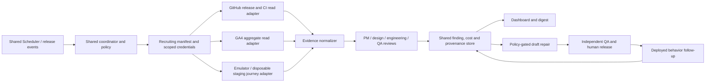

# Initiated Recruiting adapter architecture

Prepared 2026-09-28. Extends the [shared architecture](../architecture.md); the same coordinator, queue, worker pool, evidence store, budget ledger, dashboard and agent roles serve both products. Recruiting is a tenant-scoped manifest and a set of adapters, not another cloud system.

## Product boundary and manifest

Register `product_id=initiated-recruiting`, approved repository ID, staging and production project IDs, allowed artifact buckets, journey fixtures, role rubrics, action policy, monthly task budget and expected release sources. Use the Recruiting repository's current `AGENTS.md`, `CLAUDE.md`, CI workflows and release allow-list as implementation constraints. Resolve the deployed web and function revisions via authenticated read APIs; local `dev` or `main` pointers are not deployment proof. Store the environment and exact revision on every run.

The coordinator issues a short-lived capability for one product, environment, journey and action class. GitHub credentials can read only approved Recruiting resources. GA4 credentials query approved aggregate properties. Browser and test credentials reach the emulator or isolated `initiated-recruiting-staging` fixtures only; production Firebase (`recruityou-f593d`) is read only where explicitly authorized. Never put production service-account keys, raw athlete/coach records, OTPs, email addresses or unrestricted repository content in model context. Tests capture outbound email in staging; workers cannot send customer mail.

Use per-product storage prefixes and document keys, IAM conditions where supported, and server-side authorization on every tool call. The dashboard checks product access independently of the model's requested `product_id`. Negative tests must prove HoopTrace credentials cannot read Recruiting evidence and vice versa. A model prompt or repository file cannot grant itself permissions.

## Evidence and decision contracts

Each input becomes a versioned evidence record: `product_id`, `environment`, `source_kind`, `source_id`, `source_revision`, `captured_at`, `observed_at`, `fixture_version`, `role_or_cohort`, `redaction_level`, checksum and storage pointer. Each run also records manifest/prompt/model versions, action capability, cost reservation and tool calls. Findings contain expected behavior, observed behavior, independent reproduction or source query, confidence, severity, known-issue link, owner, and one of `confirmed`, `hypothesis`, `known`, `blocked`, `stale`, `insufficient_data`, or `no_change`. A missing source or mismatched deployment revision cannot yield a green result.

The claim adapter checks the existing E2E contract: `claim_started` and `claim_submitted` instrumentation when valid in the tested build, persisted `pending_review`, queued notification/captured mail, then review approval and correct profile ownership. It separates browser failure, fixture failure, emulator trigger failure, event instrumentation gap and product defect. It never processes a real athlete claim.

The coach adapter runs real test roles with the development mock Super Admin bypass **disabled**. It tests unverified denial, institution/admin approval and OTP flow in a controlled fixture, correct program binding, Terminal visibility and revocation after identity/email changes. It inspects authorization results and source-data freshness; a UI screenshot alone cannot establish access safety. A blocked admin fixture is `blocked`, not a pass. The Recruiting workflow's documented two-clocks issue is a known classification candidate; only reproduced new failures become new regressions.

The board adapter checks search → athlete profile → watchlist/offer/commit and empty states using program A/B fixtures. It compares rendered board rows with authorized backend state, tests cross-program denial and flags stale parity evidence. Data-health adapters reuse existing on-demand reports and current `terminal_qa_reports` where available. They do not create a second scheduled full test suite.

GA4 adapter queries approved aggregate claim and scouting funnels by stable event version, role/cohort and date window. E2E builds omit the measurement ID, so synthetic behavior is scored from test/emulator evidence and real-user conversion only from production GA4. The adapter records denominator, event mapping, timezone, lag and query timestamp; missing or sparse events produce `insufficient_data`. Existing tracking docs have mixed historical provider wording, so the first integration must reconcile actual GA4 event names against deployed instrumentation before PM analysis. Design review uses redacted screenshots and a versioned rubric for loading, denied, empty, mobile and desktop states, with human judgment separated from verified accessibility failures.

## Scheduling, repair and follow-up

Use existing shared GCP schedules and product manifest due times for lightweight reads. Consume GitHub CI results pinned by SHA; on-demand/release E2E remains under Recruiting's workflow rules. Do not add GitHub Actions cron or dispatch complete E2E nightly. A daily probe can be a read of latest release/health/analytics evidence; a deeper journey is triggered by a release, failure or explicit approved work order. Source outages, stale CI and quota blocks enter the dashboard as blocked runs with retry deadlines.

Read-only operation precedes any repair capability. For an authorized Recruiting category, a repair worker gets only a narrow branch/write token, approved paths, diff and runtime caps, and a work order tied to a confirmed finding. Initial patch classes can include low-risk UI, tests and instrumentation with owner-approved category policy. Identity, verification, Firestore rules/data, payments, athlete publication, NIL/legal copy and production configuration remain proposal-only. Publish only a draft PR against a current base SHA. An independent QA execution repeats the original failure and negative access tests, then records accept/reject and residual risk. Humans retain merge and release authority.

After a human-approved release, a read adapter verifies deployed revision and original behavior immediately and at 24–72 hours. Funnel effects are reported later only if cohorts and denominators support them; a passing patch or better synthetic result is not equivalent to product growth. Every run and repair is metered by product so Recruiting's **marginal** cost can be compared with its marginal value without charging shared platform fixed costs twice.
