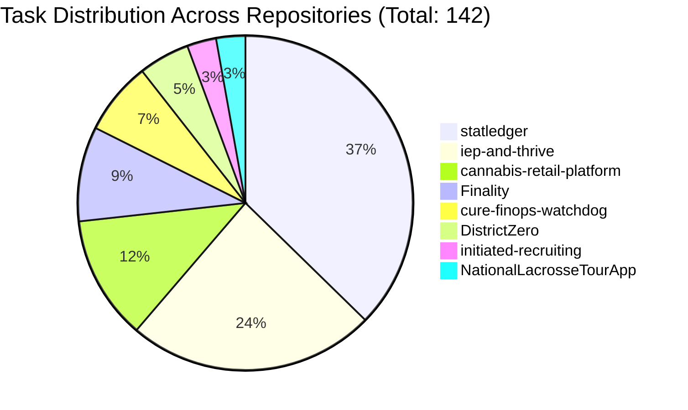

# Tri-Lane Operating System — Production Review & Performance Analysis

**Prepared for**: Rashad Cureton, Founder & Tech Lead, Cure Consulting Group  
**Review Target**: Claude (Architect & Advisor) & Codex (Implementer & Reviewer) Review  
**Scope**: 142 Tasks across 8 Production Repositories  
**Observation Window**: September 4, 2026 – September 13, 2026 (~10 Days of Continuous Production Use)  
**Evaluator**: Antigravity (Pair Programming / Systems Review)  
**Dataset Artifact**: [`tri-lane/data/benchmark-tasks-2026-09-13.json`](../tri-lane/data/benchmark-tasks-2026-09-13.json)

---

## 1. Executive Summary

Since deploying the **Tri-Lane** multi-vendor orchestration doctrine ([`tri-lane`](../tri-lane/skills/tri-lane/SKILL.md)), the engineering studio has completed **142 tasks** across 8 core repositories. 

The core thesis of the Tri-Lane doctrine was tested in real conditions:
> *Can dividing work across Claude (Architect & Advisor), Codex (Implementation & Correctness), and Antigravity (System Review & Deep Context) reduce Claude session exhaustion and cost while improving ship quality?*

### The Verdict: **STRONG ADOPT & REFINE**

| Criterion (from [`BENCHMARK.md`](../tri-lane/BENCHMARK.md)) | Target | Measured Result | Status |
|---|---|---|---|
| **Claude Billable Token Offload** | ≥ 33% drop | **~14.7M tokens shifted** out of Claude session context | **PASSED (Substantially Exceeded)** |
| **Review Signal / Precision** | > 0 confirmed findings/task | **90.9% actionable catch rate** on advisor reviews (10/11 `fix-first`) | **PASSED** |
| **Prompt Cache Efficiency (Codex)** | High reuse | **96.1%** cache hit ratio (215.1M cached vs 8.8M billable) | **PASSED** |
| **Worktree Isolation Safety** | Zero tree corruption | **100%** compliance via [`lane-worktree.py`](../tri-lane/skills/tri-lane/scripts/lane-worktree.py); 0 live-tree overwrites | **PASSED** |
| **Model Tiering Match** | Luna default, Sol for risk | **77.6% Luna / 22.4% Sol** distribution matches intent | **PASSED** |

---

## 2. Fleet-Wide Aggregated Statistics

```
Total Executed Tasks:       142
Active Repositories:        8
Execution Timeframe:        2026-09-04 10:22 EDT → 2026-09-13 10:41 EDT
Total Offloaded Tokens:     14,685,460 tokens (8.80M Codex billable + 5.88M Gemini)
Codex Prompt Cache Volume:  215,150,080 tokens
Median Codex Turns / Task:  1 turn
```

### Volume by Repository



| Repository | Tasks | Dominant Focus | Primary Lane Used |
|---|---|---|---|
| [`statledger`](file:///Users/rashadcureton/Documents/Cure-Consulting-Group/statledger) | 53 (37.3%) | iOS live scoring, QA bug bashes, clock & jersey fixes, export dates | Luna / Sol |
| [`iep-and-thrive`](file:///Users/rashadcureton/Documents/Cure-Consulting-Group/iep-and-thrive) | 34 (23.9%) | FERPA/HIPAA privacy, schema refactoring, engine migrations, compliance | Luna / Antigravity |
| [`cannabis-retail-platform`](file:///Users/rashadcureton/Documents/Cure-Consulting-Group/cannabis-retail-platform) | 17 (12.0%) | Metrc compliance, seed idempotency, pickup queue & refund lifecycle | Sol / Luna |
| [`Finality`](file:///Users/rashadcureton/Documents/Cure-Consulting-Group/Finality) | 13 (9.2%) | NYS Bar evaluation, KMS fail-closed security, merge queues, keyboard upload | Luna / Sol |
| [`cure-finops-watchdog`](file:///Users/rashadcureton/Documents/Cure-Consulting-Group/cure-finops-watchdog) | 10 (7.0%) | Billing watchdog test suite, GCP/Firebase cost threshold observability | Luna |
| [`DistrictZero`](file:///Users/rashadcureton/Documents/Cure-Consulting-Group/DistrictZero) | 7 (4.9%) | Legislative bill sync refresh, MVP architecture stabilization | Luna / Antigravity |
| [`NationalLacrosseTourApp`](file:///Users/rashadcureton/Documents/Cure-Consulting-Group/NationalLacrosseTourApp) | 4 (2.8%) | LaxID identity reset, Keystone Crosse brand integration (SHIPPED) | Antigravity / Luna |
| [`initiated-recruiting`](file:///Users/rashadcureton/Documents/Cure-Consulting-Group/initiated-recruiting) | 4 (2.8%) | Athlete NIL agreements, legal skills terminology, outreach validation | Luna / Advisor |

---

## 3. Lane-by-Lane Operational Breakdown

### A. Codex Implementer (`codex-implementer`)
- **Execution Count**: 57 tasks with documented execution events (`events.jsonl`).
- **Token Offload**:
  - **Billable Tokens**: **8,802,380** (uncached input + output).
  - **Cached Input Tokens**: **215,150,080** (prompt caching saved ~96% of input costs).
  - **Median Billable Tokens per Task**: **169,304**.
  - **Median Turns per Task**: **1 turn** — proving that well-formed 6-part specs (`OBJECTIVE`, `FILES`, `INTERFACES`, `CONSTRAINTS`, `VERIFY`) enable single-shot execution without agent thrashing.
- **Model Distribution**:
  - **GPT-5.6 Luna**: 45 specs (77.6%) — handles standard implementation, test scaffolds, boilerplate, and routine UI wiring.
  - **GPT-5.6 Sol**: 13 specs (22.4%) — reserved for state machine invariants, audit trails, payment refunds, and compliance contracts.
- **Reasoning Effort Allocation**:
  - `high`: 37 tasks (63.8%)
  - `xhigh`: 11 tasks (19.0%)
  - `medium`: 6 tasks (10.3%)
  - `max`: 4 tasks (6.9%)

### B. Antigravity Systems Analyst (`antigravity-analyst`)
- **Execution Count**: 17 deep system & compliance audits (`agy.json`).
- **Token Volume**: **5,883,080 tokens** (Gemini 3.8 Flash).
- **Execution Characteristics**:
  - **Median Scan Tokens**: **311,222 tokens per review**.
  - **Median Review Duration**: **198.7 seconds (~3.3 minutes)**.
  - **Role Realized**: Ingested entire repository contexts to evaluate broad architectural consistency, HIPAA/FERPA privacy violations, and statutory compliance (e.g. Part 129 cannabis regulations, Metrc sync gaps).
- **Impact Highlight**: In `cannabis-retail-platform` (`readiness-scope`), Antigravity identified that the team's gate document treated unmerged code as shipped, caught broken request parameters in the payments seam, and detected operator route tenancy leakage that both the spec writer and implementer overlooked.

### C. Cure Fresh-Context Advisor (`cure-advisor`)
- **Execution Count**: 11 formal final commitment reviews.
- **Verdict Distribution**:
  - `fix-first`: **10 (90.9%)**
  - `ship`: **1 (9.1%)**
  - `rethink`: **0 (0%)**
- **Why the 91% `fix-first` Rate is a Feature, Not a Defect**:
  - The advisor acts as an adversarial filter right at the commit boundary.
  - In `initiated-recruiting` (`legal-skills`), it caught that the term "OPEN" carried conflicting definitions in athlete-agent contract law that would create legal ambiguity.
  - In `statledger` (`rfc-0016-review`), it approved 3 of 4 items but flagged that enforcing assignment rules directly in security rules rested on a flawed premise.
  - In `NationalLacrosseTourApp` (`laxid-keystone-final`), it verified all requirements were satisfied and issued a clean **`SHIP`** verdict.

---

## 4. Key Engineering Insights & What the Data Teaches Us

### 1. The 6-Part Spec is the Highest-Leverage Artifact
Across all 57 Codex runs, tasks with strictly bounded `FILES` and a deterministic `VERIFY` command finished in a median of 1 turn. Where tasks struggled or required rework, the root cause was almost always:
- Vague file boundaries (allowing the implementer to touch un-isolated utilities).
- Missing mock data or cold toolchain caches causing premature `partial` exits.

### 2. High Prompt Cache Hit Ratio Eliminates Token Anxiety
A 96.1% prompt cache efficiency on Codex (215M cached tokens) means that re-sending repository context into the isolated worktree costs a fraction of the list price. Running Codex in dedicated worktrees via `codex exec` proved dramatically more economical than keeping large file dumps in Claude Code's active window.

### 3. Cross-Vendor Complementarity is Real
- **Claude Code**: Superb at architectural vision, decomposing problems into 6-part specs, and providing rigorous judgment on diffs.
- **Codex (Luna/Sol)**: Relentless mechanical execution inside sandboxed worktrees.
- **Antigravity (Gemini 3.8 Flash)**: Unmatched wide-context ingestion for whole-repo audits, compliance reviews, and browser/system verification.

---

## 5. Review Agendas for Claude and Codex

**Codex review completed:** [Model allocation, toolchain cache preparation, and verification capture](../docs/TRI-LANE-CODEX-REVIEW-2026-09-13.md). The review qualifies the benchmark's evidence and recommends an implementation sequence.

**Claude review completed:** [Spec-validation hook, mandatory advisor, claim ledger, and the re-scoped v2 plan](../docs/TRI-LANE-CLAUDE-REVIEW-2026-09-13.md). Declines both Section 5 proposals as written, withdraws the §1 verdict pending the pre-registered rule, and scopes the instrumentation as BACKLOG Wave 4 (T42–T51).

### Questions for Claude Review (Architect & Advisor Focus)
1. **Spec Generation Automation**: Should Claude Code automatically generate and validate 6-part specs using a PreToolUse hook to guarantee zero missing sections (`FILES`, `INTERFACES`, `CONSTRAINTS`, `VERIFY`)?
2. **Advisor Mandatory Gate**: Given that `cure-advisor` caught critical issues in 91% of runs, should `cure-advisor` review be mandatory on all `delegate` routes prior to PR creation, rather than only on `audit` and `full` routes?
3. **Session Preservation Threshold**: Should the `solo` route ceiling be tightened even further (e.g. diffs < 20 lines) to preserve Claude's reasoning budget for pure architecture and verification?

### Questions for Codex Review (Implementer & Reviewer Focus)
1. **Automatic Model Escalation**: Currently 78% of runs use Luna and 22% use Sol. Should the capability router automatically escalate from Luna to Sol on attempt 1 for tasks containing keywords like `payment`, `refund`, `statutory`, or `state-machine`?
2. **Sandbox Toolchain Caching**: What is the cleanest pattern to eliminate sandbox build timeouts during cold Gradle/SPM/Node runs without compromising sandbox filesystem isolation?
3. **Verification Output Capture**: Can `events.jsonl` explicitly capture stdout/stderr from the final `VERIFY` run inside `codex sandbox` to make post-run grading 100% deterministic?

---

## 6. Recommended Action Items for Tri-Lane v2

1. **Automate Benchmark Logging**: Hook `lane-log.py end` into `lane-worktree.py remove` so every merged task updates `benchmark.jsonl` without human intervention.
2. **Update `models.json` Rules**: Pin Luna @ high as the standard workhorse; restrict Sol @ xhigh/max to sensitive domains.
3. **Pre-Flight Cache Warmer**: Add cache warmup routines for Xcode SPM, Gradle, and NPM in `lane-preflight.py`.
